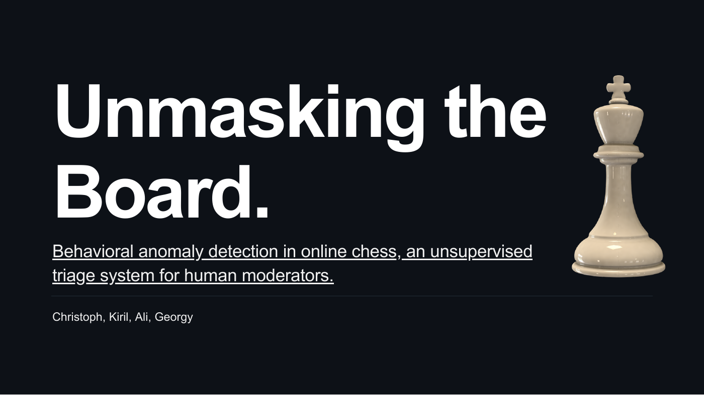
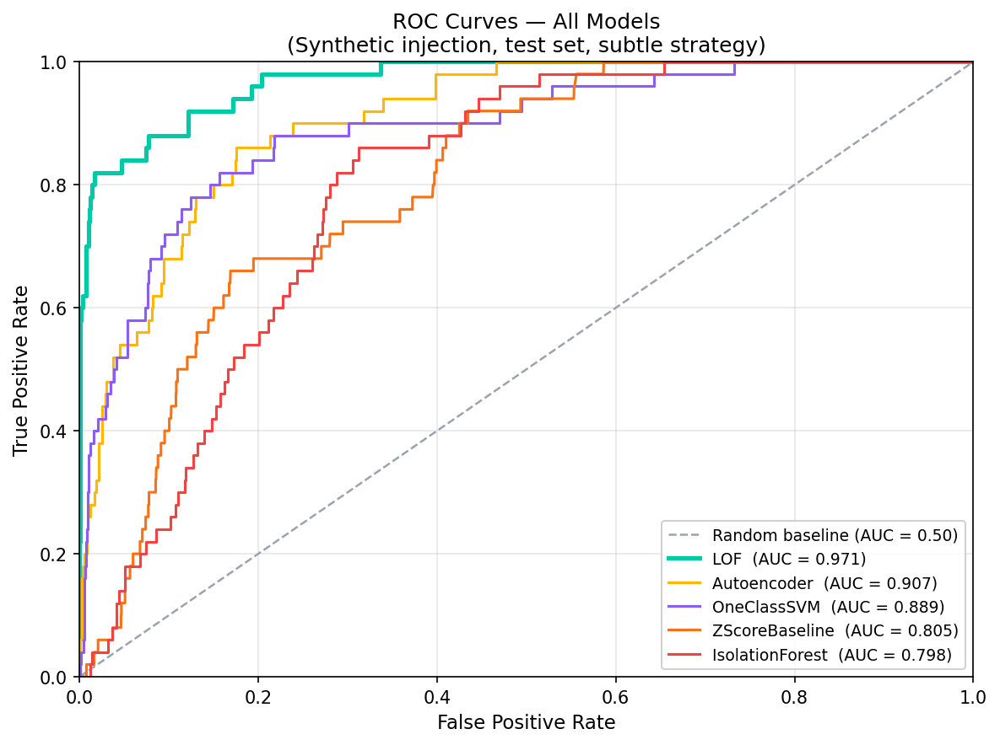
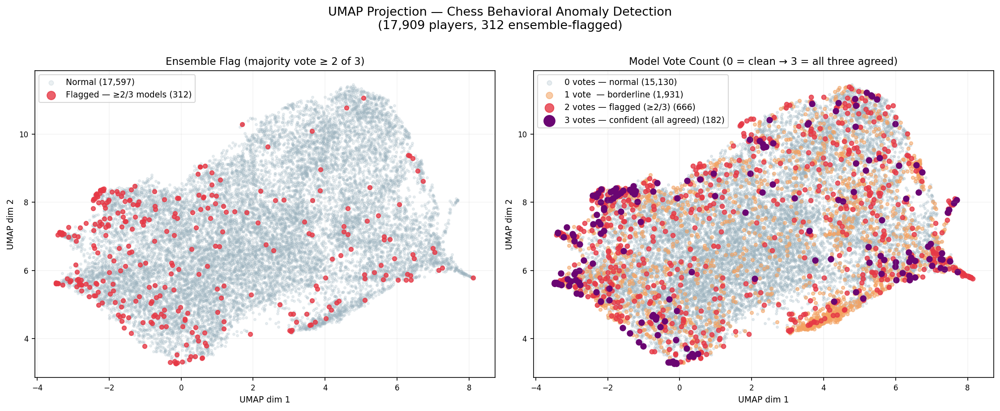

# Unmasking the Board

An unsupervised chess-analysis project that flags unusual player behavior for human review.



**[Final presentation](deliverables/final-presentation.pdf)** · **[Research report](deliverables/report.pdf)** · **[Poster](deliverables/poster.pdf)** · **[Saved results](results/)**

Machine Learning Foundations · IE University, 2026

**Team:** Christoph, Kiril, Ali, Georgy

## The question

Can patterns in a player's games help moderators decide where to look more closely, without a labeled training set of confirmed cheaters?

We turn game records into player-level features, compare seven anomaly detectors, and combine three of them into a review shortlist. A flag means **statistically unusual behavior**, not proof of cheating. The system does not automatically ban players.

## From games to a review shortlist

| Stage | What the project does |
| --- | --- |
| Data | Samples 500,000 games from the July 2016 Lichess export of 6.25 million games, focusing on rapid and classical time controls |
| Players | Analyzes 17,909 players with at least five games; 12,738 with at least 15 games are eligible for ensemble flags |
| Features | Builds 21 behavioral and chess-accuracy features, including win-rate deviation, game length, opening depth, rating volatility, and centipawn-loss measures |
| Split | Separates players into 70% training, 15% validation, and 15% test sets before fitting normalization; rating-band statistics and scaling use training players |
| Models | Compares Z-Score, Isolation Forest, Local Outlier Factor (LOF), One-Class SVM, Autoencoder, ACPLSubAutoencoder, and HDBSCAN |
| Ensemble | Flags eligible players when at least two of LOF, Autoencoder, and One-Class SVM agree; three-way agreement forms a smaller shortlist |

The ensemble flags **312 players**: **1.7% of all 17,909 players**, or **about 2.5% of the 12,738 flagging-eligible players**. These are review candidates, not confirmed positives.

## Results — and what they measure

With no confirmed cheating labels for evaluation, the project tests recovery of deliberately injected synthetic anomalies. The primary `subtle` strategy shifts a subset of features; `realistic_cheater` changes accuracy signals while preserving normal-looking behavioral features.

| LOF test scenario | ROC-AUC | Average precision | Recall@k |
| --- | ---: | ---: | ---: |
| Subtle synthetic injection | **0.971** | **0.720** | **0.62** at k = 50 |
| Accuracy-only synthetic evasion (`realistic_cheater`) | **0.740** | **0.065** | **0.01** at k = 100 |

Values are rounded from [`holdout_evaluation.csv`](results/holdout_evaluation.csv). The scenarios use different injection counts and k values; they probe different failure modes rather than measuring real-world detection accuracy. Five-fold training-set CV gives LOF **ROC-AUC 0.959 ± 0.030** (mean ± standard deviation in the [saved CV table](results/cv_summary.csv)).



LOF performs strongly on the primary synthetic benchmark, but the harder accuracy-only scenario exposes a clear limit. Clock-based features, such as variation in move time, are a proposed next step requiring suitable clock-annotated data; this repository does not establish that they solve the problem.



The projection helps inspect where flagged players sit in feature space. It is a diagnostic visualization, not validation of cheating labels. Model disagreement and feature-level explanations support human review.

## Explore without running an experiment

- **[Final presentation](deliverables/final-presentation.pdf):** question, data, seven detectors, results, and failure analysis.
- **[Report](deliverables/report.pdf) and [poster](deliverables/poster.pdf):** the research write-up and visual summary.
- **[Player results](results/all_player_results.csv) and [explanations](results/player_explanations.csv):** scores, ensemble flags, and feature-level context.
- **[Decision log](decisions.md):** methodological choices and revisions.
- **[Notebooks](notebooks/):** EDA, preprocessing, and modeling on the smaller included dataset. Their outputs differ from the full-data research results; notebook 03 also loads saved full-run results for comparison.

## Reproduce the work

Use **Python 3.10+**; the project recommends 3.12. Install the listed dependencies in a virtual environment:

```sh
python -m venv .venv
source .venv/bin/activate
python -m pip install -r requirements.txt
```

On Windows, activate with `.venv\Scripts\Activate.ps1` in PowerShell. Alternatively, use `conda env create -f environment.yml` followed by `conda activate chess-anomaly`. A short checkout path can help avoid Windows/Jupyter path-length issues.

### Quick checks and notebook walkthrough

```sh
python -m pytest
python -c "from src.data_loader import load_raw; print(load_raw().shape)"
jupyter lab notebooks/01_eda.ipynb
```

The eight existing tests check feature aggregation and feature-matrix behavior. The included Kaggle mirror, `data/raw/games.csv`, has 20,058 rows and 16 columns. It supports the smaller notebook walkthrough without downloading the full research dataset.

### Full research pipeline

1. Download the [large chess dataset from Kaggle](https://www.kaggle.com/datasets/arevel/chess-games), using its website or an authenticated Kaggle CLI.
2. Extract the July 2016 CSV and place it at **`data/raw/lichess_jul2016.csv`**. This large file is not included in the repository.
3. From the repository root, run:

```sh
python -m src.pipeline
```

The module entry point selects the Lichess dataset and extended features. A full run can take hours and writes into `results/`; preserve the committed outputs before regenerating them. Saved results are already available for inspection without retraining. Dependency versions are lower-bounded rather than locked, so a fresh environment is not a promise of bit-for-bit reproduction.

Optional Stockfish analysis of the small dataset uses `STOCKFISH_PATH` or a `stockfish` executable on PATH. See [`src/config.py`](src/config.py) for dataset paths, sample size, eligibility thresholds, and model settings.

## Code map

| Path | Responsibility |
| --- | --- |
| [`src/lichess_loader.py`](src/lichess_loader.py), [`src/data_loader.py`](src/data_loader.py) | Data loading and player records |
| [`src/features.py`](src/features.py) | Aggregation and feature engineering |
| [`src/models.py`](src/models.py) | Anomaly detectors and ensemble |
| [`src/validation.py`](src/validation.py) | Synthetic injection and evaluation |
| [`src/interpretation.py`](src/interpretation.py) | Diagnostics and explanations |
| [`src/pipeline.py`](src/pipeline.py) | Experiment orchestration |
